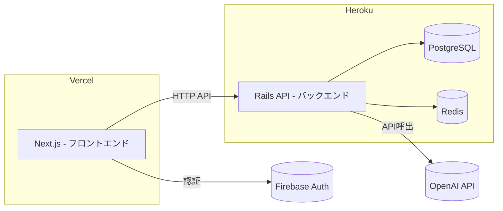
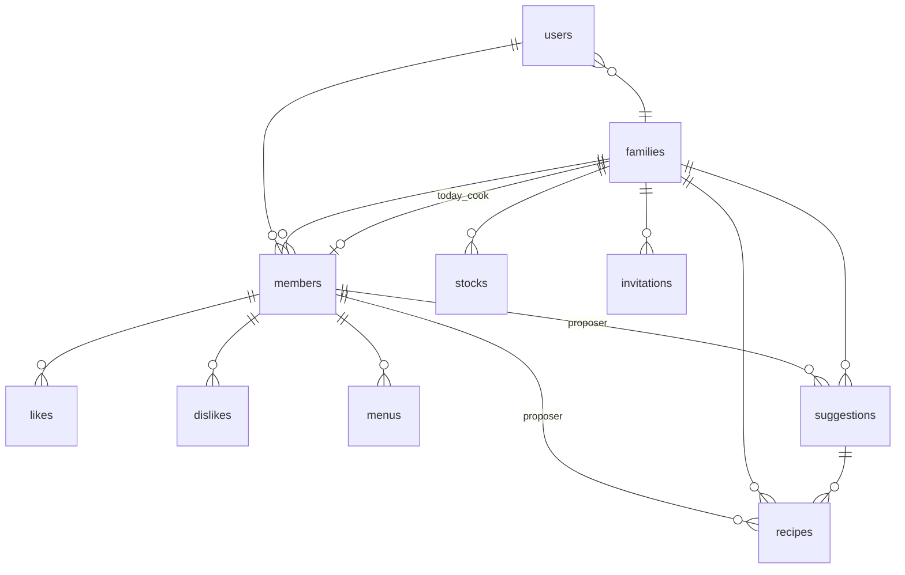

# FamDish

## 📝 概要

FamDish は、家族単位での献立管理に特化したWebアプリケーションです。
家族メンバーの好み・嫌いな食材・冷蔵庫の在庫をもとに、AIがパーソナライズされたレシピを自動生成します。

このプロジェクトでは以下を実践しています：

- ドメイン駆動のDB設計（User / Member / Family の正規化）
- Rails APIモードによるRESTful API開発
- OpenAI APIとの連携によるAIレシピ生成
- Firebase Authenticationを用いた認証基盤
- レスポンスペイロードの最適化（一覧用と詳細用のシリアライザ分離）

---

## 🌐 デモ

|                 | URL                                 |
| --------------- | ----------------------------------- |
| フロントエンド  | https://famdish-xxxxx.vercel.app    |
| バックエンドAPI | https://famdish-xxxxx.herokuapp.com |

テストアカウント：

```
email: test@example.com
password: password
```

---

## ✨ 機能一覧

- 家族ベースの複数ユーザー管理
- AIによる献立提案（好み・在庫を考慮）
- AIによるレシピ解説（手順・不足食材の自動算出）
- 冷蔵庫の在庫管理
- メンバーの好き嫌い管理
- トークンベースの家族招待システム
- メニュー・提案への「いいね」機能
- お問い合わせフォーム

---

## 💡 技術的な工夫

- **Member モデルによる正規化** — User と Family の間に Member を設け、1ユーザーが家族に所属する関係を正規化。家族メンバー（子供など）はユーザーアカウントなしでも登録可能
- **レスポンスペイロードの最適化** — 一覧用（`recipe_list_json`）と詳細用（`recipe_detail_json`）でシリアライザを分離し、不要なデータ転送を削減
- **DBクエリの最適化** — `Member.select(:id, :name)` や `includes` の適切な使用でN+1問題を回避
- **RESTful設計の徹底** — POST → 201 Created / PATCH → 204 No Content / DELETE → 204 No Content で統一
- **AIプロンプト設計** — 在庫情報・制限時間を考慮した動的プロンプト生成で、実用的なレシピを出力
- **外部キー制約とインデックス** — 全リレーションに外部キー制約を付与し、データ整合性を担保
- **Redis** によるキャッシュ導入でレスポンス高速化
- **CI/CD パイプライン**の構築

---

## 🚀 今後の改善点

- ロールベースのアクセス制御（管理者 / 一般メンバー）の導入
- プッシュ通知システムの追加
- テストカバレッジの向上（RSpec / Jest）

---

## 主な機能

- 家族メンバーによる献立提案
- AIによる献立提案
- AIによるレシピ解説
- お気に入りメニューの保存
- ユーザー認証（Firebase）
- お問い合わせフォーム

---

## 技術スタック

### フロントエンド

- Next.js
- TypeScript
- Tailwind CSS

### バックエンド

- Ruby on Rails 8.0（APIモード）
- PostgreSQL
- Redis

### インフラ

- Vercel（フロントエンド）
- Heroku（バックエンド）
- Heroku Postgres（データベース）
- Heroku Key-Value Store（Redis）
- Firebase Authentication（認証）

---

## 全体アーキテクチャ



---

## ER図



### テーブル一覧

| テーブル      | 主なカラム                                                                                                | 説明                             |
| ------------- | --------------------------------------------------------------------------------------------------------- | -------------------------------- |
| `users`       | firebase_uid, family_id                                                                                   | Firebase認証ユーザー             |
| `families`    | name, today_cook_id                                                                                       | 家族グループ                     |
| `members`     | name, family_id, user_id                                                                                  | 家族メンバー（ユーザーに紐付く） |
| `likes`       | member_id, name                                                                                           | メンバーの好きな食べ物           |
| `dislikes`    | member_id, name                                                                                           | メンバーの嫌いな食べ物           |
| `menus`       | name, member_id                                                                                           | 保存されたメニュー               |
| `suggestions` | family_id, proposer, requests, ai_raw_json, chosen_option, feedback                                       | AI献立提案                       |
| `recipes`     | dish_name, proposer, family_id, suggestion_id, servings, missing_ingredients, cooking_time, steps, reason | レシピ（手順・材料付き）         |
| `stocks`      | family_id, name, quantity, unit                                                                           | 冷蔵庫の在庫                     |
| `goods`       | user_id, menu_id, suggestion_id                                                                           | メニュー・提案への「いいね」     |
| `invitations` | token, family_id, used, expires_at                                                                        | 家族招待トークン                 |
| `contacts`    | name, email, subject, message                                                                             | お問い合わせ                     |

---

## APIエンドポイント

### 設計方針

- RESTful JSON API（Rails APIモード）
- Firebase認証（`Authorization: Bearer <idToken>`）
- `POST` → `201 Created`（リソース本体を返却）
- `PATCH` → `204 No Content`
- `DELETE` → `204 No Content`
- 一覧エンドポイントは軽量JSON（詳細データなし）
- 詳細エンドポイントはフルJSON

### エンドポイント一覧

| メソッド         | エンドポイント                      | 説明                        |
| ---------------- | ----------------------------------- | --------------------------- |
| `GET`            | `/api/health`                       | ヘルスチェック              |
| **メニュー**     |                                     |                             |
| `GET`            | `/api/menus`                        | 家族のメニュー一覧          |
| `GET`            | `/api/menus/:id`                    | メニュー詳細                |
| `POST`           | `/api/menus`                        | メニュー作成                |
| `PATCH`          | `/api/menus/:id`                    | メニュー更新                |
| `DELETE`         | `/api/menus/:id`                    | メニュー削除                |
| **メンバー**     |                                     |                             |
| `GET`            | `/api/members`                      | メンバー一覧                |
| `GET`            | `/api/members/me`                   | ログイン中のメンバー情報    |
| `GET`            | `/api/members/all`                  | 全家族メンバー（id + name） |
| `POST`           | `/api/members`                      | メンバー作成                |
| `PATCH`          | `/api/members/:id`                  | メンバー更新                |
| `DELETE`         | `/api/members/:id`                  | メンバー削除                |
| **好き嫌い**     |                                     |                             |
| `GET`            | `/api/likes`                        | 好きな食べ物一覧            |
| **在庫**         |                                     |                             |
| `GET`            | `/api/stocks`                       | 家族の在庫一覧              |
| `POST`           | `/api/stocks`                       | 在庫追加                    |
| `PATCH`          | `/api/stocks/:id`                   | 在庫更新                    |
| `DELETE`         | `/api/stocks/:id`                   | 在庫削除                    |
| **献立提案**     |                                     |                             |
| `POST`           | `/api/suggestions`                  | AI献立提案を作成            |
| `POST`           | `/api/suggestions/:id/feedback`     | フィードバック送信          |
| **家族**         |                                     |                             |
| `GET`            | `/api/families`                     | 家族情報取得                |
| `POST`           | `/api/families/assign_cook`         | 今日の料理担当を設定        |
| **いいね**       |                                     |                             |
| `POST`           | `/api/goods`                        | メニューにいいね            |
| `DELETE`         | `/api/goods/:id`                    | メニューのいいね取消        |
| `GET`            | `/api/goods/check`                  | メニューのいいね確認        |
| `GET`            | `/api/goods/count`                  | メニューのいいね数          |
| `GET`            | `/api/goods/check_suggestion`       | 提案のいいね確認            |
| `GET`            | `/api/goods/count_suggestion`       | 提案のいいね数              |
| `POST`           | `/api/goods/create_suggestion`      | 提案にいいね                |
| `DELETE`         | `/api/goods/:id/destroy_suggestion` | 提案のいいね取消            |
| **レシピ**       |                                     |                             |
| `GET`            | `/api/recipes`                      | 全レシピ一覧                |
| `GET`            | `/api/recipes/family`               | 家族のレシピ一覧            |
| `POST`           | `/api/recipes/explain`              | AIレシピ解説                |
| `GET`            | `/api/recipes/:id`                  | レシピ詳細                  |
| `POST`           | `/api/recipes`                      | レシピ保存                  |
| `PATCH`          | `/api/recipes/:id`                  | レシピ更新                  |
| `DELETE`         | `/api/recipes/:id`                  | レシピ削除                  |
| **招待**         |                                     |                             |
| `POST`           | `/api/invitations`                  | 招待リンク作成              |
| `GET`            | `/api/invitations/:token`           | 招待情報表示                |
| `POST`           | `/api/invitations/:token/accept`    | 招待を承認                  |
| **ユーザー**     |                                     |                             |
| `DELETE`         | `/api/users/me`                     | アカウント削除              |
| **お問い合わせ** |                                     |                             |
| `POST`           | `/api/contacts`                     | お問い合わせ送信            |

---

## ドメインベース構造

### バックエンド（Rails API）

```
app/
├── controllers/api/     # ドメインごとのAPIエンドポイント
│   ├── menus_controller.rb
│   ├── members_controller.rb
│   ├── recipes_controller.rb
│   ├── suggestions_controller.rb
│   ├── stocks_controller.rb
│   ├── families_controller.rb
│   ├── goods_controller.rb
│   ├── invitations_controller.rb
│   ├── users_controller.rb
│   └── contacts_controller.rb
├── models/              # ドメインモデル（リレーション定義）
│   ├── user.rb          # Firebase認証ユーザー
│   ├── family.rb        # 家族グループ
│   ├── member.rb        # 家族メンバー（ユーザーに紐付く）
│   ├── menu.rb          # 保存されたメニュー
│   ├── suggestion.rb    # AI献立提案
│   ├── recipe.rb        # レシピ（手順・材料付き）
│   ├── stock.rb         # 冷蔵庫の在庫
│   ├── like.rb          # 好きな食べ物
│   ├── dislike.rb       # 嫌いな食べ物
│   ├── good.rb          # メニュー・提案へのいいね
│   ├── invitation.rb    # 家族招待トークン
│   └── contact.rb       # お問い合わせ
```

### フロントエンド（Next.js）

```
src/
├── app/                 # Next.js App Router（ページ）
│   ├── menus/           # メニューページ
│   ├── members/         # メンバーページ
│   ├── stock/           # 在庫管理
│   ├── mypage/          # マイページ
│   ├── contact/         # お問い合わせフォーム
│   ├── invite/          # 招待フロー
│   ├── login/           # 認証ページ
│   └── request/         # 献立リクエスト
├── features/            # ドメインベースの機能モジュール
│   ├── auth/            # 認証（Firebase）
│   │   ├── components/
│   │   ├── hooks/
│   │   └── lib/
│   ├── menu/            # メニュー機能
│   │   ├── api/
│   │   ├── components/
│   │   └── hooks/
│   ├── recipe/          # レシピ機能
│   │   ├── components/
│   │   └── hooks/
│   ├── member/          # メンバー機能
│   ├── stock/           # 在庫機能
│   └── profile/         # プロフィール機能
```

---

## セットアップ

### バックエンド

```bash
bundle install
rails db:create db:migrate db:seed
rails s
```

### フロントエンド

```bash
npm install
npm run dev
```

---

## 環境変数

| 変数名                | 説明                    |
| --------------------- | ----------------------- |
| `DATABASE_URL`        | PostgreSQL 接続文字列   |
| `FIREBASE_PROJECT_ID` | Firebase プロジェクトID |
| `OPENAI_API_KEY`      | OpenAI APIキー          |
