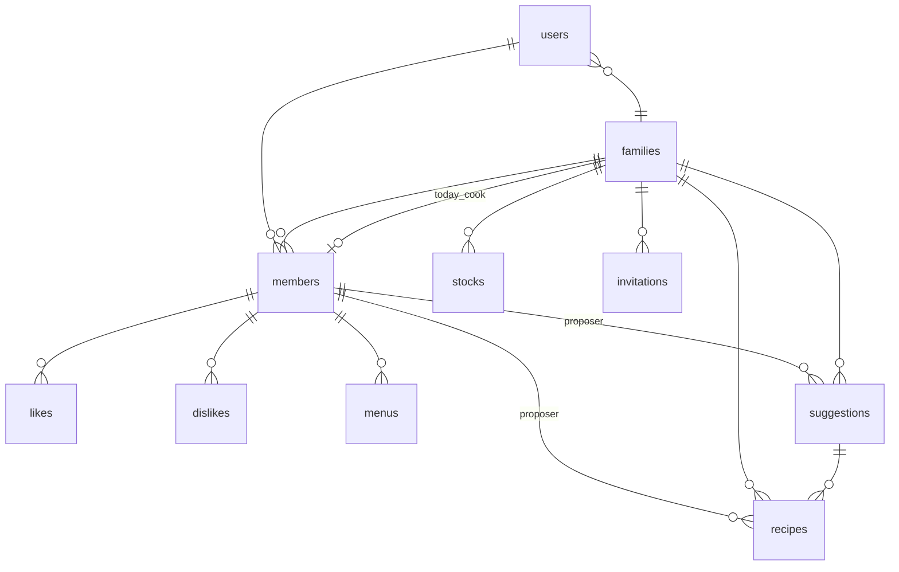

# FamDish Backend

AI が家族の好み・冷蔵庫の食材・予算から最適な献立を提案する Web アプリケーションのバックエンドです。

---

## 1. 技術スタック（Tech Stack）

| カテゴリ        | 技術                                                     |
| --------------- | -------------------------------------------------------- |
| フレームワーク  | Ruby on Rails 8.0.2（API モード）                        |
| 言語            | Ruby 3.4.4                                               |
| DB              | PostgreSQL（`pg` gem）                                   |
| Web サーバ      | Puma 6.x                                                 |
| 認証            | Firebase Authentication（`firebase_id_token` gem + JWT） |
| 非同期ジョブ    | Solid Queue（DB バックエンド）                           |
| キャッシュ      | Solid Cache（DB バックエンド）                           |
| Action Cable    | Solid Cable（DB バックエンド）                           |
| CORS            | rack-cors                                                |
| Lint / 静的解析 | RuboCop（rubocop-rails-omakase）+ Brakeman               |
| テスト          | RSpec + FactoryBot + Shoulda Matchers + SimpleCov        |
| コンテナ        | Docker                                                   |
| デプロイ        | Heroku                                                   |
| CI/CD           | GitHub Actions                                           |

## 2. ER図


```mermaid
erDiagram
  users ||--o{ members : ""
  users }o--|| families : ""
  families ||--o{ members : ""
  families ||--o| members : "today_cook"
  members ||--o{ likes : ""
  members ||--o{ dislikes : ""
  members ||--o{ menus : ""
  members ||--o{ suggestions : "proposer"
  members ||--o{ recipes : "proposer"
  families ||--o{ stocks : ""
  families ||--o{ suggestions : ""
  families ||--o{ recipes : ""
  families ||--o{ invitations : ""
  suggestions ||--o{ recipes : ""
```

## 3. APIエンドポイント

### 設計方針

- RESTful JSON API（Rails APIモード）
- Firebase認証（`Authorization: Bearer <idToken>`）
- `POST` → `201 Created`（リソース本体を返却）
- `PATCH` → `204 No Content`
- `DELETE` → `204 No Content`
- 一覧エンドポイントは軽量JSON（詳細データなし）
- 詳細エンドポイントはフルJSON

## 4. 技術的な工夫

- **Member モデルによる正規化** — User と Family の間に Member を設け、1ユーザーが家族に所属する関係を正規化。家族メンバー（子供など）はユーザーアカウントなしでも登録可能
- **レスポンスペイロードの最適化** — 一覧用（`recipe_list_json`）と詳細用（`recipe_detail_json`）で分離し、不要なデータ転送を削減
- **DBクエリの最適化** — `Member.select(:id, :name)` や `includes` の適切な使用でN+1問題を回避
- **RESTful設計** — POST → 201 Created / PATCH → 204 No Content / DELETE → 204 No Content で統一
- **AIプロンプト設計** — 在庫情報・制限時間を考慮した動的プロンプト生成で、実用的なレシピを出力
- **外部キー制約とインデックス** — 全リレーションに外部キー制約を付与し、データ整合性を担保
- **Redisによるキャッシュ導入** - サーバに依存しない認証基盤を作成するため、Redisを共通の認証ストアとして使用
- **Solid Queueの導入** — 重い処理（AI提案生成など）を後回しにして、ユーザー体験を良くするため、Solid Queue を導入して、バックグラウンドジョブを実行
- **CI/CD パイプライン**の構築

---

## 4. テーブル一覧

| テーブル      | 主なカラム                                                                                                | 説明                             |
| ------------- | --------------------------------------------------------------------------------------------------------- | -------------------------------- |
| `users`       | firebase_uid, family_id                                                                                   | Firebase認証ユーザー             |
| `families`    | name, today_cook_id                                                                                       | 家族グループ                     |
| `members`     | name, family_id, user_id                                                                                  | 家族メンバー（ユーザーに紐付く） |
| `likes`       | member_id, name                                                                                           | メンバーの好きな食べ物           |
| `dislikes`    | member_id, name                                                                                           | メンバーの嫌いな食べ物           |
| `menus`       | name, member_id                                                                                           | 保存されたメニュー               |
| `suggestions` | family_id, proposer, requests, ai_raw_json, chosen_option, feedback, status                               | AI献立提案                       |
| `recipes`     | dish_name, proposer, family_id, suggestion_id, servings, missing_ingredients, cooking_time, steps, reason | レシピ（手順・材料付き）         |
| `stocks`      | family_id, name, quantity, unit                                                                           | 冷蔵庫の在庫                     |
| `goods`       | user_id, menu_id, suggestion_id                                                                           | メニュー・提案への「いいね」     |
| `invitations` | token, family_id, used, expires_at                                                                        | 家族招待トークン                 |
| `contacts`    | name, email, subject, message                                                                             | お問い合わせ                     |

---

## 5. エンドポイント一覧

| メソッド         | エンドポイント                      | 説明                        |
| ---------------- | ----------------------------------- | --------------------------- |
| `GET`            | `/api/health`                       | ヘルスチェック              |
| **メニュー**     |                                     |                             |
| `GET`            | `/api/menus`                        | 家族のメニュー一覧          |
| `POST`           | `/api/menus`                        | メニュー作成                |
| `PATCH`          | `/api/menus/:id`                    | メニュー更新                |
| `DELETE`         | `/api/menus/:id`                    | メニュー削除                |
| **メンバー**     |                                     |                             |
| `GET`            | `/api/members`                      | メンバー一覧                |
| `GET`            | `/api/members/me`                   | ログイン中のメンバー情報    |
| `GET`            | `/api/members/all`                  | 全家族メンバー（id + name） |
| `POST`           | `/api/members`                      | メンバー作成                |
| `PATCH`          | `/api/members/:id`                  | メンバー更新                |
| `DELETE`         | `/api/members/:id`                  | メンバー削除                |
| **好き嫌い**     |                                     |                             |
| `GET`            | `/api/likes`                        | 好きな食べ物一覧            |
| **在庫**         |                                     |                             |
| `GET`            | `/api/stocks`                       | 家族の在庫一覧              |
| `POST`           | `/api/stocks`                       | 在庫追加                    |
| `PATCH`          | `/api/stocks/:id`                   | 在庫更新                    |
| `DELETE`         | `/api/stocks/:id`                   | 在庫削除                    |
| **献立提案**     |                                     |                             |
| `POST`           | `/api/suggestions`                  | AI献立提案を作成            |
| `GET`            | `/api/suggestions/:id`              | 提案のステータス・結果取得  |
| `POST`           | `/api/suggestions/:id/feedback`     | フィードバック送信          |
| **家族**         |                                     |                             |
| `GET`            | `/api/families`                     | 家族情報取得                |
| `POST`           | `/api/families/assign_cook`         | 今日の料理担当を設定        |
| **いいね**       |                                     |                             |
| `POST`           | `/api/goods`                        | メニューにいいね            |
| `DELETE`         | `/api/goods/:id`                    | メニューのいいね取消        |
| `GET`            | `/api/goods/check`                  | メニューのいいね確認        |
| `GET`            | `/api/goods/count`                  | メニューのいいね数          |
| `GET`            | `/api/goods/check_suggestion`       | 提案のいいね確認            |
| `GET`            | `/api/goods/count_suggestion`       | 提案のいいね数              |
| `POST`           | `/api/goods/create_suggestion`      | 提案にいいね                |
| `DELETE`         | `/api/goods/:id/destroy_suggestion` | 提案のいいね取消            |
| **レシピ**       |                                     |                             |
| `GET`            | `/api/recipes`                      | 全レシピ一覧                |
| `GET`            | `/api/recipes/family`               | 家族のレシピ一覧            |
| `POST`           | `/api/recipes/explain`              | AIレシピ解説                |
| `GET`            | `/api/recipes/:id`                  | レシピ詳細                  |
| `POST`           | `/api/recipes`                      | レシピ保存                  |
| `PATCH`          | `/api/recipes/:id`                  | レシピ更新                  |
| `DELETE`         | `/api/recipes/:id`                  | レシピ削除                  |
| **招待**         |                                     |                             |
| `POST`           | `/api/invitations`                  | 招待リンク作成              |
| `GET`            | `/api/invitations/:token`           | 招待情報表示                |
| `POST`           | `/api/invitations/:token/accept`    | 招待を承認                  |
| **ユーザー**     |                                     |                             |
| `DELETE`         | `/api/users/me`                     | アカウント削除              |
| **お問い合わせ** |                                     |                             |
| `POST`           | `/api/contacts`                     | お問い合わせ送信            |

---

## 6. ファイル構造

```
app/
├── controllers/
│   ├── application_controller.rb  # 認証・共通処理
│   ├── test_controller.rb         # テスト用リセット・シード
│   └── api/                       # ドメインごとのAPIエンドポイント
│       ├── contacts_controller.rb
│       ├── families_controller.rb
│       ├── goods_controller.rb
│       ├── invitations_controller.rb
│       ├── likes_controller.rb
│       ├── members_controller.rb
│       ├── menus_controller.rb
│       ├── recipes_controller.rb
│       ├── stocks_controller.rb
│       ├── suggestions_controller.rb
│       └── users_controller.rb
├── models/              # ドメインモデル（リレーション定義）
│   ├── user.rb          # Firebase認証ユーザー
│   ├── family.rb        # 家族グループ
│   ├── member.rb        # 家族メンバー（ユーザーに紐付く）
│   ├── menu.rb          # 保存されたメニュー
│   ├── suggestion.rb    # AI献立提案
│   ├── recipe.rb        # レシピ（手順・材料付き）
│   ├── stock.rb         # 冷蔵庫の在庫
│   ├── like.rb          # 好きな食べ物
│   ├── dislike.rb       # 嫌いな食べ物
│   ├── good.rb          # メニュー・提案へのいいね
│   ├── invitation.rb    # 家族招待トークン
│   └── contact.rb       # お問い合わせ
├── jobs/                # バックグラウンドジョブ
│   ├── application_job.rb
│   └── suggestion_generate_job.rb  # AI献立生成ジョブ
```

## 7. テスト設計

- CI/CDパイプライン通過

[](https://github.com/YukiYonekura-321/famdish-backend-rails/actions/workflows/backend.yml)

- テストのカバレッジは99%

[](https://codecov.io/gh/YukiYonekura-321/famdish-backend-rails)

### 7.1 テスト戦略の考え方

**スコープ**: 約160～170テスト（モデル・リクエスト・ジョブテスト）で以下の懸念事項をカバー

- **データ整合性**: リレーション・外部キー制約の動作確認
- **認証・認可**: Firebase認証、クロスファミリーデータ隔離
- **ビジネスロジック**: AI献立提案のステータス遷移、招待トークン有効期限
- **API仕様**: ステータスコード、レスポンス形式

**テスト環境**:

- `transactional fixtures` でテスト間の完全な隔離
- `SimpleCov` で自動カバレッジ測定・リポート生成
- `FactoryBot` で再利用性の高いテストデータ定義

---

### 7.2 主要テストカバレッジ

#### a. モデルテスト（~60テスト）

| モデル                   | テスト項目                                                                              | 根拠                                                          |
| ------------------------ | --------------------------------------------------------------------------------------- | ------------------------------------------------------------- |
| **User**                 | UID一意性・必須性、Family関連付け                                                       | 認証基盤→誤ったUID登録回避                                    |
| **Member**               | User/Family/Like/Dislike/Menu 関連付け                                                  | 家族構造の正規化検証 → メンバーレベルのデータ所有権確立       |
| **Suggestion**           | status 必須・包含検証(`pending\|processing\|completed\|failed`)、ステータス遷移メソッド | AI提案のライフサイクル管理 → 非同期ジョブ進捗の可視化         |
| **Recipe**               | dish_name必須、Member/Suggestion/Family 関連付け                                        | レシピの検索・フィルタリング時にNULLチェック→クエリエラー防止 |
| **Invitation**           | token一意性・必須、expires_at 妥当性、`valid_invitation?` · `mark_as_used!` メソッド    | トークン再利用攻撃防止 → 家族招待プロセスの安全性             |
| **Good**                 | user_id必須、`menu_id OR suggestion_id` カスタムバリデーション                          | 「いいね」の二重登録防止 + データ整合性                       |
| **Stock, Menu, Contact** | 必須フィールド・形式検証                                                                | CRUD時の入力値チェック → 不正なデータの DB流入防止            |

**なぜモデルテストが重要か**:

- Rails では`model.valid?` 呼び出しの **前** に controller で Strong Parameters を適用し、その後 model validations が追加チェックするため、`validate` 層は最後の砦
- 外部キー制約と組み合わせることで、データベース・アプリケーション両レイヤーでのツールチェーン検証を実現

---

#### b. リクエスト/エンドポイントテスト（~100テスト）

**完全カバレッジ（✅）**:

- **認証** (`spec/requests/auth_spec.rb`): Firebase トークン検証、証明書エラーハンドリング → 401/403 エラー適切返却
- **ユーザー** (`users_spec.rb`): DELETE /api/users/me でカスケード削除（User → Member → Like/Dislike/Menu）
- **メンバー** (`members_spec.rb`): GET/POST/PATCH/DELETE + クロスファミリー隔離チェック
- **家族** (`families_spec.rb`): GET + assign_cook（今日の料理担当設定）
- **在庫** (`stocks_spec.rb`): 完全CRUD + **ファミリー間のデータ隔離チェック** → 他家族の在庫表示防止
- **献立** (`suggestions_spec.rb`): \
  - POST 作成時に `SuggestionGenerateJob.perform_later` キューイング確認
  - GET ステータス別結果取得（pending/completed/failed）
  - POST feedback でステータス更新
- **レシピ** (`recipes_spec.rb`): CRUD + `/api/recipes/family` で自家族レシピ取得 + `/api/recipes/explain` で AI解説呼び出し
- **招待** (`invitations_spec.rb`): \
  - トークン生成 → 有効期限検証 → 承認時に user と family を自動リンク
- **いいね** (`goods_spec.rb`): メニュー/提案別いいね管理、重複チェック

**カバレッジ不足（⚠️）**:

- **Dislikes**: コントローラ・リクエストテストが未実装（モデルのみ存在）

**なぜ request テストが重要か**:

- model テストは「個別のルール」を検証するが、request テストは「API全体のフロー」を検証
- 特に **認証・認可（クロスファミリー隔離）** は request レベルでしか現れない懸念事項 → request spec で必須

---

#### c. ジョブテスト（8テスト）

**SuggestionGenerateJob** (`spec/jobs/suggestion_generate_job_spec.rb`):

```ruby
✅ 正常系: AI提案生成 → status: "completed"
✅ 異常系: API呼び出し失敗 → status: "failed"
✅ 多日献立: days > 1 での複数日提案
✅ 制約条件: 予算・調理時間を踏まえたAIプロンプト生成
✅ フィードバック: 前回提案の feedback を参照した再提案
✅ キューイング: ActiveJob レジスタ確認
```

**なぜジョブテストが重要か**:

- Solid Queue を使う場合、非同期処理の **例外発生をサイレント化** してしまう → ステータス値で進捗追跡が唯一の可視化手段
- ジョブ内で status を "failed" にセット → フロントエンド・API でユーザーに失敗を通知可能
- テストで failure path を明示的に検証しないと、本番でエラーが隠れたままになる

---

### 7.3 テスト実行方法

テストはローカル環境で実行するため、ローカル環境にRubyがない場合は、インストールが必要です。バージョンは**3.4.4**としてください。

また、テストを実行するために、Bundlerをインストールしてください。

```bash
gem install bundler
```

Gemfileに書かれたGem(Rspecなど)をインストールしてください。

```bash
bundle install
```

テストはPostgreSQLが必要なので、インストールして、testDBを作成してください。

```bash
RAILS_ENV=test rails db:create
```

また、config/database.ymlは現在、Docker用の設定になっているので、ローカル環境のPostgreSQLに変更してください。
特に、testセクションの**host: db**を忘れずに削除してください。

最後に、Redisをローカル環境にインストールしてください。

```bash
# 全テスト実行
bundle exec rspec

# モデルテストのみ
bundle exec rspec spec/models

# リクエストテストのみ
bundle exec rspec spec/requests

# 特定ファイル実行
bundle exec rspec spec/models/suggestion_spec.rb

# カバレッジレポート生成
COVERAGE=true bundle exec rspec
# → coverage/index.html で可視化
```

---

### 7.4 テスト設計の継続的改善

- 新機能追加時: Model + Request + (Job) テストを同時実装（TDD原則）
- パフォーマンス低下検知: N+1 query test や平均応答時間テストの導入も検討

### 7.5 テスト追加による成果

以下のバグをテスト追加で検出し、修正済み:

#### 発見したバグ

`MenusController` に `show` アクションが存在しないにも関わらず、`before_action :set_family, only: [:index, :show]` が設定されていたケース。
Rails 7.1 以降で有効な `config.action_controller.raise_on_missing_callback_actions=true` の環境では、`show` アクションが存在しないと起動時に例外が発生するため、アプリ起動/エンドポイント利用が不能になる可能性がある。

#### 修正内容

- `Api::MenusController` の `before_action :set_family` を `only: [:index]` に限定し、実装されていない `show` を含まないよう調整。
- `config/routes.rb` の `resources :menus` は `only: [:index, :create, :update, :destroy]` のまま維持し、`show` を明示的に含めない仕様を確定。
- 追加テストにて、`GET /api/menus` が `200 OK` かつ家族境界が維持されることを確認。

#### なぜこの修正を追加したか

- `raise_on_missing_callback_actions` による早期検出 (Rails 7.1+) を前提とした運用堅牢性向上。
- 未実装アクションを参照する設定が原因の起動失敗を防止し、テストカバレッジと実行安定性を向上。
- 仕様変更の影響を放置せず、API設計を実コードと整合させた。
